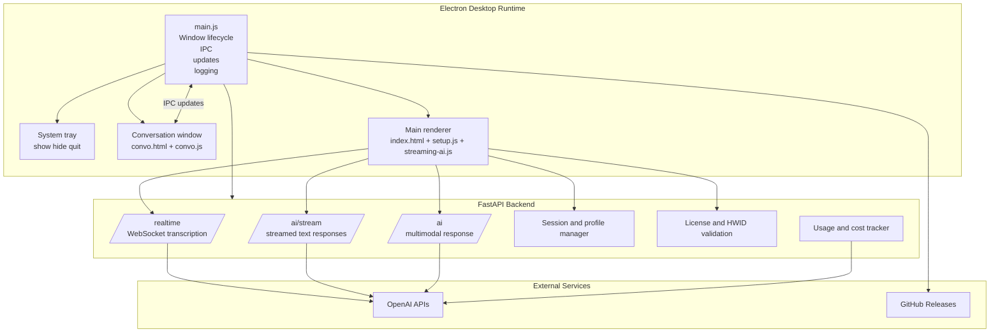
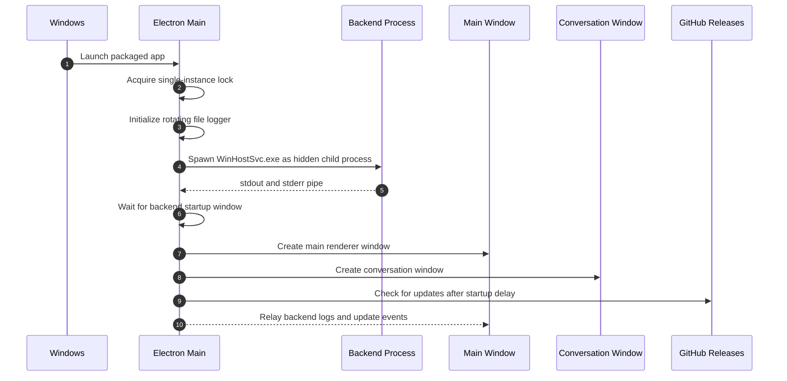
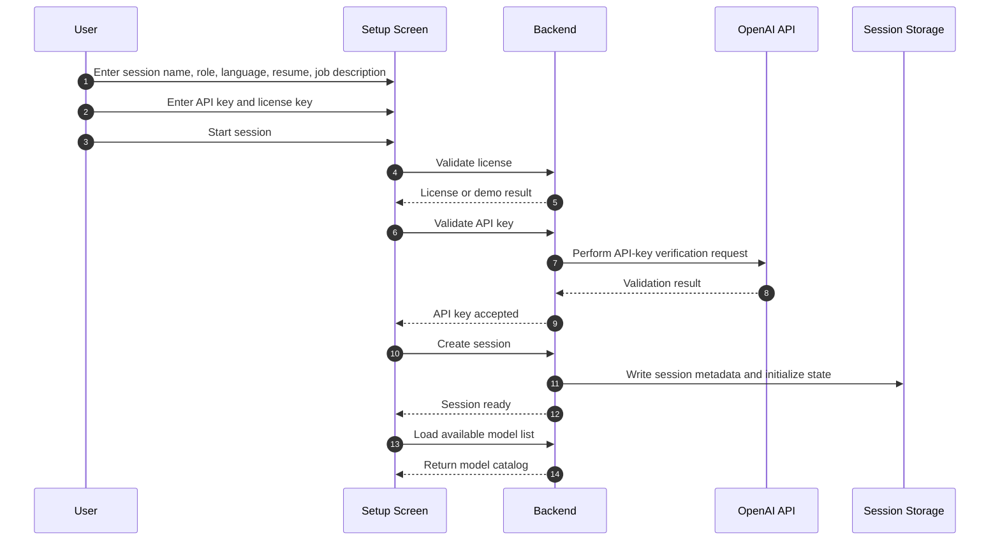
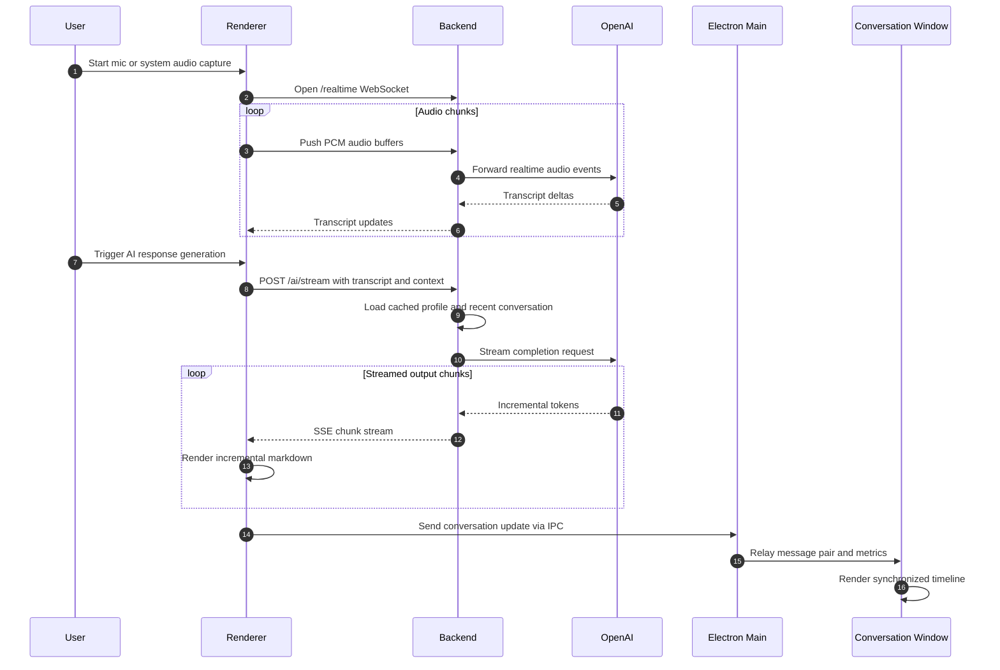
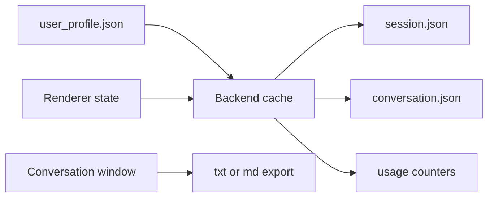
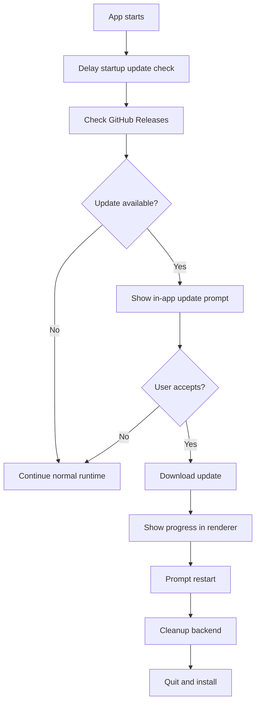

# RealTime Context Engine

RealTime Context Engine is a Windows-first desktop workspace for technical interview preparation, mock interviews, solution walkthroughs, and real-time engineering note support. It combines an Electron desktop shell with a FastAPI backend to provide low-latency audio transcription, streamed AI assistance, screenshot analysis, persistent session management, and a dedicated conversation timeline.

The system is designed as an engineering productivity surface rather than a browser plugin or a web-only application. The desktop runtime owns window management, operating-system integration, audio and screen capture handoff, application lifecycle, logging, updates, and conversation export. The backend owns model access, streaming orchestration, session persistence, transcript-to-response workflows, token accounting, license validation, and cost tracking.

## What This Project Does

- Creates structured interview or practice sessions with session metadata, role focus, language focus, resume context, and job description context.
- Captures live microphone or system audio and transcribes it in real time over a WebSocket pipeline.
- Streams AI responses into the desktop UI with timing, token, and cost telemetry.
- Supports screenshot-assisted analysis for coding prompts, diagrams, whiteboards, terminals, and architecture questions.
- Maintains a floating conversation window for a persistent message-oriented timeline.
- Persists sessions and conversation state so work can be resumed later.
- Tracks usage and cost so long-running sessions stay measurable.
- Ships as a packaged Windows desktop app with auto-update support.

## Product Positioning

This repository is best understood as a real-time engineering interview workspace:

- Useful for mock interviews and structured technical practice.
- Useful for software engineering and data engineering preparation.
- Useful for system-design walkthroughs, coding prompt analysis, and resume-aligned Q and A sessions.
- Useful as a desktop orchestration layer for multimodal AI-assisted preparation workflows.

The architecture is intentionally desktop-native, low-friction, and optimized for long-running sessions with context reuse.

## Core Capabilities

### Real-Time Audio Transcription

The app supports both microphone capture and system-audio capture. Audio is chunked in the renderer, pushed over a WebSocket connection to the backend, and forwarded to a realtime transcription model.

### Streaming AI Responses

The main interview surface sends transcript and session context to the backend, which streams model output back as SSE-style chunks. The UI renders output incrementally and records timing metrics such as TTFT and total generation time.

### Screenshot-Aware Analysis

The renderer can capture a desktop frame, encode it, and send it to the backend for multimodal reasoning. This is particularly useful for coding tasks, terminal output, whiteboard sketches, dashboards, schemas, and architecture diagrams.

### Session Persistence

Session metadata, profile context, and conversation history are written to disk and can be reloaded later. The backend also keeps a rolling summary so long sessions do not explode token costs.

### Floating Conversation Window

The dedicated conversation window presents the running session as a message timeline, separate from the main working surface. It supports export and remains synchronized through Electron IPC.

### Mini Mode

The UI can collapse into a tiny desktop presence while preserving state, making it easier to keep a session alive without occupying full screen space.

### Logging and Diagnostics

The Electron main process writes a rotating log file and now also relays backend startup and runtime logs into the setup surface, making it easier to reason about backend readiness and runtime state.

## High-Level Architecture



## End-to-End Runtime Overview

At runtime the desktop shell starts first, then launches the backend as a hidden child process, waits briefly for backend readiness, creates the main and conversation windows, restores renderer state, and then begins normal interaction. All higher-order workflows branch from that point: session creation, audio streaming, streamed generation, screenshot reasoning, conversation export, and session reload.

## Startup Flow



### Startup Responsibilities by Layer

#### Electron main process

- Enforces single-instance execution.
- Creates and rotates the application log file.
- Starts the backend executable and captures stdout and stderr.
- Creates the main window and conversation window.
- Owns IPC bridges for screen sources, conversation export, app reset, version lookup, and log relay.
- Initializes the tray menu and auto-updater.

#### Backend process

- Boots the FastAPI service.
- Initializes pricing tables, model catalog, and usage counters.
- Resolves the persistent storage base directory.
- Accepts realtime, REST, and session-management traffic.

#### Renderer

- Boots the setup screen and interactive session UI.
- Displays application version.
- Shows backend log lines in a terminal-style setup panel.
- Registers error and update listeners.

## Session Creation Flow

Session creation is the first major workflow. It collects interview or practice context, validates access, validates model credentials, persists profile state, then creates an active session that can later be resumed.



### Inputs Collected During Session Setup

- Session name
- Target role
- Target language
- Resume document
- Job description text
- OpenAI API key
- License key
- Preference flags such as ESL mode and short responses

### Why Session Setup Matters Architecturally

The setup workflow is not just form collection. It is where the backend receives the long-lived context that later drives streamed responses:

- Resume context informs experience-aligned suggestions.
- Job description context anchors answers toward a target role.
- Role and language fields tune the response style.
- Profile data is cached so repeated requests do not rebuild context unnecessarily.
- Session metadata creates a resumable boundary for long workflows.

## Interview and Practice Loop

The core runtime loop consists of audio capture, transcript accumulation, streamed generation, optional screenshot enrichment, UI rendering, and conversation persistence.



### Runtime Phases

#### Phase 1: transcription

The app can listen to microphone input or system audio. The renderer converts audio samples, encodes them, and streams them to `/realtime`. The backend acts as the orchestrator for the realtime model and relays transcript deltas back to the renderer.

#### Phase 2: streamed response generation

The user can submit the transcript for answer generation. The backend assembles the request from:

- Current transcript
- Session profile context
- Cached resume and job description context
- Recent conversation history
- Rolling summary of older turns
- Selected model

The backend then calls the model provider and forwards chunks to the UI as they arrive.

#### Phase 3: screenshot-assisted reasoning

When visual context matters, the renderer captures a desktop frame through Electron’s screen-source flow and sends it to `/ai`. The backend estimates image token cost, runs the request against a multimodal-capable model, and returns the response.

## Context and Memory Strategy

One of the strongest architectural decisions in the project is that it treats long sessions as a context-management problem rather than a naive append-everything problem.

### Context layers

- Stable profile context: role, language, resume, job description
- Recent working context: latest turns kept in memory
- Compressed historical context: rolling summary for older interactions
- Persistent disk context: session metadata and conversation history

### Why this matters

- Reduces repeated prompt bloat.
- Improves response latency.
- Lowers token cost over long sessions.
- Preserves continuity without sending the entire conversation every time.

## Backend API Surface

The backend exposes a compact but complete API surface for transcription, reasoning, persistence, licensing, and usage.

### Core interactive endpoints

- `/realtime` WebSocket: live audio transcription workflow
- `/ai/stream` POST: streamed text response generation
- `/ai` POST: multimodal response flow, including screenshots
- `/models` GET: available text models and metadata

### Session endpoints

- `/session/create` POST
- `/session/resume` POST
- `/session/save` POST
- `/session/conversation` POST
- `/session/end` POST
- `/sessions` GET
- `/session/load/{session_name}` GET
- `/session/delete/{session_name}` DELETE

### Profile and access endpoints

- `/profile` GET
- `/profile` POST
- `/profile/resume` POST
- `/validate-api-key` POST
- `/validate-license` POST
- `/get-hwid` GET

### Usage and maintenance endpoints

- `/conversation/clear` POST
- `/conversation/history` GET
- `/usage` GET
- `/usage/reset` POST

## Window Model

The application uses a two-window desktop pattern.

### Main window

The main window owns setup, transcript capture, response rendering, model control, status, and action buttons. It is optimized for the active working loop.

### Conversation window

The conversation window acts as a separate timeline surface. It receives updates through IPC, renders the paired user and assistant messages, tracks metrics, and supports export.

### Mini mode

Mini mode temporarily collapses the main UI into a minimal desktop footprint without ending the session. This is a state-preserving UI contraction, not a teardown.

## IPC Design

Electron IPC is the coordination layer between renderer surfaces and the main process.

### Representative IPC flows

- Renderer asks main process for available screen sources.
- Renderer sends conversation updates for relay to the conversation window.
- Renderer requests conversation export.
- Renderer requests app reset or application version.
- Main process pushes update events and backend log events back into the renderer.

This separation keeps OS integration in the main process while allowing the renderer to stay focused on UI logic.

## Data Persistence Model



### Persistent artifacts

- User profile file with saved configuration and API key state
- Session directories for named sessions
- Per-session metadata files
- Conversation history files
- Application log file under Electron user data

## Usage and Cost Tracking

The backend keeps an explicit accounting model for input tokens, output tokens, image tokens, request counts, and cumulative estimated cost.

### Why this matters

- Makes long sessions observable.
- Helps users choose between speed and quality.
- Prevents the product from feeling like a black box.
- Makes the system more credible for sustained engineering workflows.

## Auto-Update Flow

The app uses `electron-updater` with GitHub Releases as the publish target.



## Logging and Observability

The desktop runtime includes a rotating file logger and forwards backend runtime lines into the renderer. This gives the app multiple observability layers:

- Persistent file log for support and diagnostics
- In-app setup terminal for backend readiness and visibility
- Console output during development
- Renderer-side error forwarding back to the main process log

## Security and Operational Boundaries

From an engineering perspective, the application separates responsibilities cleanly:

- Desktop process handles OS integration and packaging concerns.
- Backend process handles data flow, model access, and persistence.
- Renderer handles UX, state transitions, and real-time display.

The product should be described as a desktop engineering workspace, not as a browser exploit, scraper, or automation implant. It does not depend on browser extensions, DOM injection into third-party sites, or adversarial instrumentation against remote platforms. Its value comes from orchestration, multimodal context handling, and low-latency engineering workflows.

## Repository Structure

```text
release_package/
├── backend/
│   ├── main.py
│   ├── requirements.txt
│   ├── process_resume.py
│   ├── create_version_info.py
│   └── sessions/
├── frontend/
│   ├── package.json
│   ├── main.js
│   ├── index.html
│   ├── setup.js
│   ├── setup.css
│   ├── convo.html
│   ├── convo.js
│   └── streaming-ai.js
├── build-all.bat
└── README.md
```

## Local Development

### Frontend

From the `frontend` directory:

```bash
npm install
npm run start:dev
```

### Backend

From the `backend` directory:

```bash
pip install -r requirements.txt
uvicorn main:app --port 5050
```

### Packaging

From the `frontend` directory:

```bash
npm run build
```

The packaged application embeds the compiled backend executable as an extra resource and uses NSIS for Windows distribution.

## Design Principles

### Desktop-first

The application assumes desktop-native control over windows, audio sources, and packaging.

### Long-session aware

The architecture is built for real sessions, not toy prompts. That is why token accounting, rolling summaries, persistence, and resumability exist.

### Low-friction orchestration

The product reduces glue work between capture, transcription, reasoning, persistence, and export.

### Observable runtime

A solid engineering tool should be diagnosable. Logging, backend terminal output, and update state all support that.

## Best Fit Use Cases

- Technical interview preparation
- Data engineering interview practice
- Software engineering mock sessions
- System design walkthroughs
- Resume-to-job-description alignment analysis
- Screenshot-based coding or diagram review
- Long-form technical rehearsal sessions

## Summary

RealTime Context Engine is a Windows desktop orchestration layer for real-time technical practice. Architecturally, it is a two-process system: Electron on the desktop boundary and FastAPI at the AI workflow boundary. The value of the project comes from combining live transcription, streamed responses, screenshot reasoning, session persistence, conversation replay, cost tracking, and packaging into one coherent engineering workspace.

If you are evaluating the codebase as a product, the most important qualities are:

- Clear separation of concerns
- Practical multimodal workflow design
- Strong session and context management
- Long-session token and cost awareness
- Desktop-native operability
- Production-minded packaging and updating

That combination is what makes the system interesting from a software engineering and data engineering tooling perspective.
