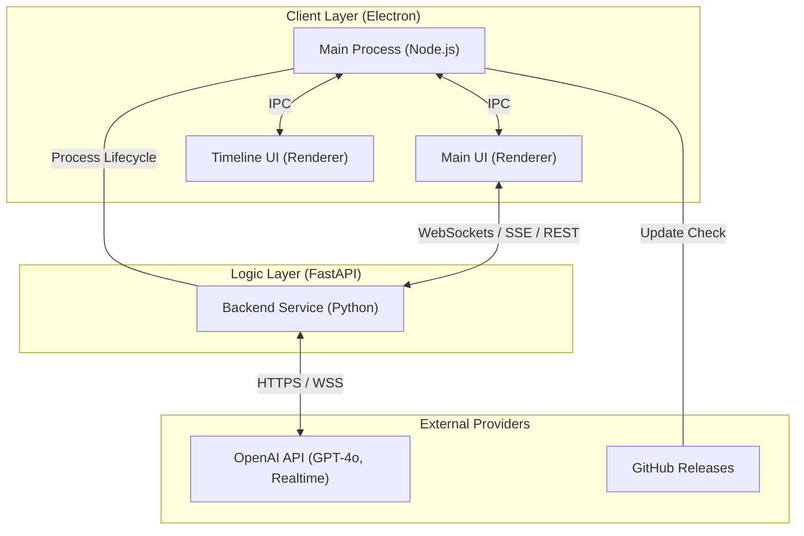

# RealTime Context Engine - System Architecture

This document provides a comprehensive end-to-end technical overview of the RealTime Context Engine, a Windows-native technical interview preparation workspace.

## 1. High-Level Overview

The system is architected as a **decoupled multi-process application** consisting of a desktop-native UI and a local AI orchestration service. It bridges real-time system/microphone audio, desktop visual context, and multimodal AI models.

### System Topology

---

## 2. Component Architecture

### 2.1 Desktop Layer (Electron)
The desktop layer manages the Windows runtime environment, windowing, and OS integration.

- **Main Process (`main.js`)**:
    - **App Lifecycle**: Handles startup, single-instance locking, and clean shutdown.
    - **Backend Orchestration**: Spawns `WinHostSvc.exe` as a hidden child process and monitors its health via pipes.
    - **Global Shortcuts**: Manages system-wide hotkeys (e.g., `Ctrl+M` for mic, `Ctrl+K` for screenshot).
    - **IPC Hub**: Acts as a bridge between the Main UI and the Conversation Timeline window.
    - **Auto-Updater**: Uses `electron-updater` to pull releases from GitHub.

- **Renderer Process (Main UI)**:
    - **Audio Capture**: Handles real-time PCM audio chunking from `navigator.mediaDevices`.
    - **Streaming AI**: Implements the EventSource (SSE) client for incremental response rendering.
    - **Visual Capture**: Uses Electron's `desktopCapturer` to grab screen frames for multimodal analysis.

- **Renderer Process (Conversation UI)**:
    - A dedicated, lightweight timeline surface that remains synchronized via IPC.

### 2.2 API Layer (FastAPI)
The backend service (`backend/main.py`) acts as the "Brain" of the application, managing models, memory, and persistence.

- **FastAPI Service**: Provides the interface for the frontend.
- **Key Modules**:
    - **Real-time Pipeline**: A WebSocket endpoint (`/realtime`) that proxies audio to OpenAI's Realtime API.
    - **Context Engine**: Manages the "Memory Stack" (Resume, Job Description, and Conversation History).
    - **Token Tracker**: Accurately counts tokens using `tiktoken` to estimate session costs.

---

## 3. Communication Models

### 3.1 Inter-Process Communication (IPC)
Electron IPC is used for high-frequency synchronization between the two UI windows and for hardware-level requests (like finding screen sources).

### 3.2 Network & Streaming
The connection between the UI and the Backend uses three distinct patterns:
1. **WebSockets (`/realtime`)**: For latency-sensitive audio streaming and transcript deltas.
2. **Server-Sent Events (SSE) (`/ai/stream`)**: For streaming long-form AI text responses.
3. **REST (JSON)**: For standard operations like session management, profile updates, and static model requests.

---

## 4. Context & Persistence Strategy

The system treats long-running sessions as a **Context Management Problem**. It avoids "Token Bloat" through a layered memory approach.

- **Memory Layers**:
    1. **System Prompt**: Cached hash of Resume + Job Description (only resent if changed).
    2. **Short-Term Memory**: Recent conversation turns sent in full.
    3. **Long-Term Memory**: Older turns are summarized into a "Context Note" to preserve continuity without high costs.

- **Data Storage**:
    - **User Profile**: `user_profile.json` (API keys, preferences).
    - **Sessions**: Individual folders containing `session.json` and `conversation.json`.
    - **Logs**: Rotating file logger (`app-log.txt`) stored in `AppData`.

---

## 5. Security & Licensing

- **Hardware ID (HWID)**: The backend generates a unique fingerprint based on CPU, MAC address, and OS metadata.
- **RSA Licensing**: License keys are RSA-2048 signatures of the HWID. The backend enforces valid signatures to unlocked full features.
- **Stealth Mode**: The Main Window uses `win.setContentProtection(true)` to prevent the UI itself from being captured in recordings or screenshots.

---

## 6. Build & Deployment

The project uses a unified build pipeline:
1. **Python Build**: Backend is compiled into `WinHostSvc.exe` using PyInstaller.
2. **Electron Build**: `electron-builder` packages the frontend and embeds the backend executable as an `extraResource`.
3. **Distribution**: Code-signed NSIS installers are published to GitHub Releases.
